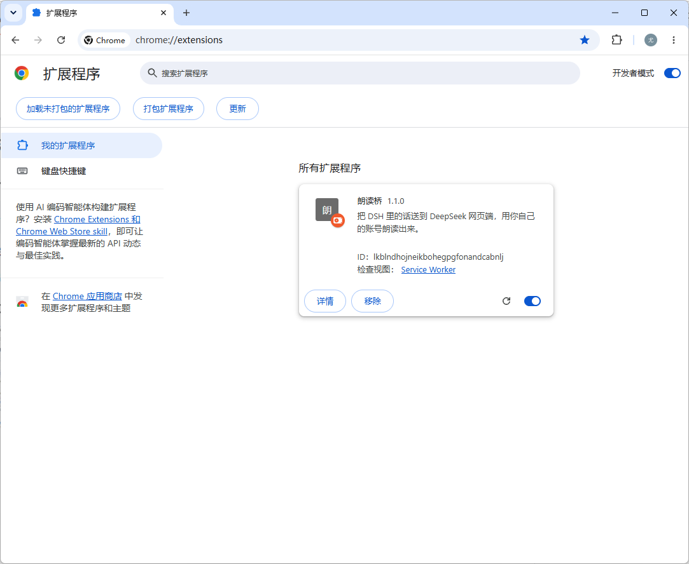
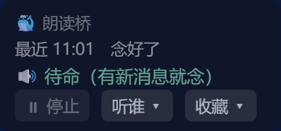

# 🐳 朗读桥

**让 DSH 里的会话，用 DeepSeek 网页端的声音念出来。**

大肥鱼说了一句话 → 自动发到 DeepSeek 网页端让它复述 → 用你自己账号的朗读功能出声。
声音从你的电脑里出来，你不用盯着那个页面。

> 名字里的「桥」就是这个意思：**DSH 这边知道说了什么，浏览器那边负责让声音出来**，中间靠它接起来。

---

## 它由两部分组成（缺一不可）

| | 是什么 | 干什么 |
|---|---|---|
| **① DSH 插件** `dsh-tts-bridge` | 住在 DSH 里 | 盯着你选的会话，把「说完一整轮」的话排进队列 |
| **② 浏览器扩展** 「朗读桥」 | 住在 Chrome / Edge 里 | 取走队列里的话，发给 DeepSeek，点它的「朗读」按钮 |

---

## 需要什么

- **DSH**（DeepSeek Harness），带 Web 界面
- **Chromium 内核的浏览器**：Chrome / Edge / Brave 等（Firefox 不行）
- **一个你自己的 DeepSeek 账号**（朗读是它给每个账号的功能）
- 用的时候，**那个 DeepSeek 页面要开着**（真正出声的是它）

---

## 装法

### 第一步：装 DSH 插件

```sh
dsh plugin --profile web add dsh-tts-bridge
```

装完**重启一次 DSH**。

重启后，DSH 窗口右下角会出现一张小卡片 **🐳 朗读桥**。

### 第二步：装浏览器扩展



1. 打开 `chrome://extensions`（Edge 用 `edge://extensions`）
2. 打开「**开发者模式**」（Chrome 在右上角，Edge 在左下角）
3. 点「**加载已解压的扩展程序**」，选中 `extension/` 这个文件夹
4. 打开 <https://chat.deepseek.com> 并**登录你自己的账号**
5. 这个页面左下角会出现一行状态字 —— 装好了

> Chrome 每次启动可能提醒一句「请停用开发者模式扩展」，点保留或关掉都行，不影响使用。
> **`extension/` 这个文件夹在哪？**
>
> 它就在插件的安装目录里，不用去 GitHub 下：
>
> - **网页版（npx）**：`%USERPROFILE%\.dsh\profiles\web\node_modules\dsh-tts-bridge\extension`
> - **桌面版**：`%APPDATA%\dsh-desktop\harness\profiles\web\node_modules\dsh-tts-bridge\extension`
>
> （把上面那行整个复制到资源管理器的地址栏，回车就跳过去了。**如果朗读桥的卡片提示「还差一步」，说明就是这一步没做。**）

### 第三步：第一次先自己点一下朗读（**必做**）

浏览器不信任「程序点的按钮」，只信任**真人点的**。所以第一次用之前：

1. 在 DeepSeek 那个页面里，**用鼠标点一下它自己的「朗读」按钮**（随便点一下页面也行）
2. 之后就一直能出声了 —— 自动念、点我们的 ▶，都不用再点

（这是浏览器定的规矩，绕不过去。哪天又不出声了，再真点一下就好。）

---

## 怎么用

### 每条回复下面三个键

| 键 | 作用 |
|---|---|
| **▶ 朗读** | 让 DeepSeek 念这一条（哪一条都行，不用是最新的） |
| **⏸ 停止** | 停 |
| **♡ 收藏** | 把这一条记下来（再点一下取消） |

### DSH 右下角的小卡片 🐳 朗读桥



| | |
|---|---|
| **⏸ 停止** | 一键停 —— 不管声音是从哪儿念出来的 |
| **听谁 ▾** | 勾选要听哪些对话（**默认一个都不听**，自己勾；可以勾多个） |
| **收藏 ▾** | 分区收藏：点句子重念、`⇄` 换分区、`✕` 删掉；最下面能**导出成 markdown** |
| 按住状态行 0.6 秒 | 开关「自动朗读」 |

- **自动朗读**开着时，你选的会话里每说完一整轮，就自动念出来
- 卡片**整张按住就能拖**，位置记得住
- 状态行会写它现在在干嘛：`待命` / `已发给 DeepSeek，等它复述…` / `正在出声…`

### 只列「开着的」对话

「听谁」里只能勾**当前载入着的**会话 —— 插件只能读被载入的会话。
**归档**的对话会自动从清单里去掉，也不再听。

---

## 数据在哪

```
<DSH_HOME>/.dsh/tts-bridge.json
```

「听谁」和「收藏」都在里面，重启不丢。

---

## 常见问题

| 现象 | 原因 / 怎么办 |
|---|---|
| **点了朗读，图标在转但没声音** | 在这个页面**真点一下**（点它自己的「朗读」按钮），再点我们的 ▶ |
| **卡片不见了** | DSH 插件没跑起来 → 重启 DSH |
| **一直卡在「等它复述」** | 把 DeepSeek 那个页面按 **F5** |
| **它自己弹了个 DeepSeek 窗口出来** | 这是「自愈」：页面不在、而队列里又有话，它就自己叫回来 |
| **念出来的话不是你要的** | 插件认的是「末尾那条回复」；如果页面上正好有别的变化，按 F5 再试 |

---

## 兼容性

| 浏览器 | |
|---|---|
| Chrome / Edge / Brave 等 Chromium 内核 | ✅ 可用（Edge 实测通过） |
| Firefox | ❌ 扩展机制不同，需要另写一版 |

---

## 关于合规（请读一下）

- 它**不碰 DeepSeek 的接口、不提取音频、不存任何凭证**。
  扩展做的事，就是在**你自己登录的浏览器里，替你点一下「朗读」按钮** —— 跟你手动点是一样的动作。
- **每个人用自己的账号**，插件里不存账号也不存 cookie。
- **如果你把它的效果发到公开平台**（视频、截图），里面出现 DeepSeek 生成的内容时，
  请按平台和 DeepSeek 用户协议的要求**标明「内容由 AI 生成」**。
- **请不要**在插件名、图标或宣传里使用「DeepSeek」「深度求索」的商标和 logo，也不要做得像官方出品。
- 朗读有**每日限额**，用得太猛会被限。

（本项目与深度求索公司无关，非官方工具。）

---

## 许可

MIT
